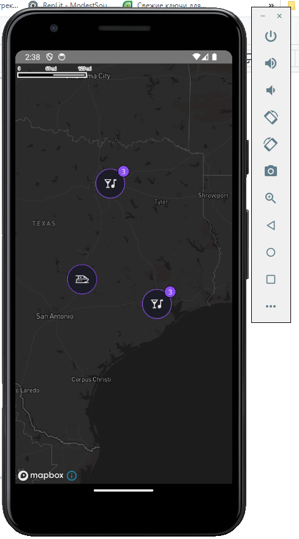
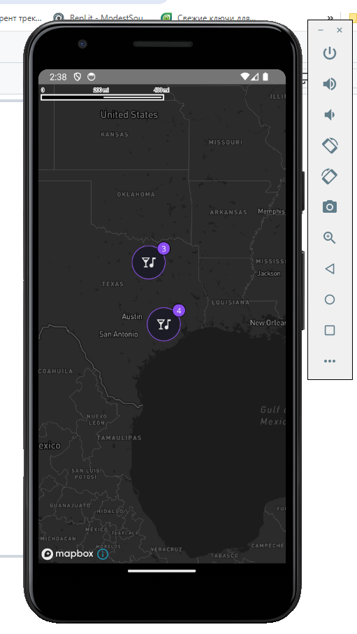

# Implementation of markers clustering with react-native and mapbox (rnmapbox)
***
## https://github.com/rnmapbox/maps
## https://github.com/rnmapbox/maps/blob/11fe88d7dc6f93d2325b724a381fb5ffadc88211/docs/SymbolLayer.md#iconignoreplacement

## To start locally:
- open terminal;
- execute command: ```npm run android``` for android
- execute command: ```npm run ios``` for ios
***



